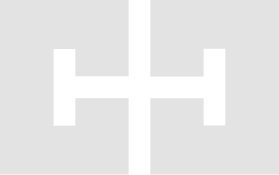

  

<h1 align="center">Carlos Costa</h1>

  <strong>Frontend, Mobile & UI/UX Developer</strong> 
  <em>Building lean interfaces, reusable tools, and digital products with care for design and code.</em>

  
  
  
  
  
  

---

  
  &nbsp;
  
  &nbsp;
  
  &nbsp;
  
  &nbsp;
  
  &nbsp;
  
  &nbsp;
  
  &nbsp;
  
  &nbsp;
  
  &nbsp;
  
  &nbsp;
  
  &nbsp;
  
  &nbsp;
  

---

### About

Developer and designer from Natal/RN, Brazil. I work with **frontend web**, **Flutter/Android mobile apps**, and **UI/UX**, building interfaces, libraries, and digital products.

### More Projects

<b>Web / JavaScript / TypeScript</b>

- [Resume Json](https://github.com/carllosnc/resume-json)
- [Bible Data](https://github.com/carllosnc/bible-data)
- [Summy](https://github.com/carllosnc/summy)
- [Try-Ts](https://github.com/carllosnc/try-ts)
- [Metadata-api](https://github.com/carllosnc/metadata-api)
- [One Stack](https://github.com/carllosnc/one-stack)
- [Backend Stack](https://github.com/carllosnc/backend-stack)
- [Auth Server](https://github.com/carllosnc/auth-server)
- [GetMoov](https://github.com/carllosnc/getmoov)

<b>Flutter / Dart</b>

- [Fabric](https://github.com/carllosnc/fabric)
- [Hty](https://github.com/carllosnc/hty)
- [Flutter Starter](https://github.com/carllosnc/flutter_starter)
- [ReFlutter](https://github.com/carllosnc/reflutter)
- [Steps](https://github.com/carllosnc/steps)
- [Try-Dart](https://github.com/carllosnc/try-dart)
- [Gty](https://github.com/carllosnc/gty)
- [Reactive Preferences](https://github.com/carllosnc/reactive_preferences)
- [Flex Field](https://github.com/carllosnc/flex_field)

<b>Other Stacks</b>

- **C#:** [Bible Json](https://github.com/carllosnc/bible_json)
- **Python:** [AIC](https://github.com/carllosnc/aic)
- **Jetpack Compose:** [Seeno](https://github.com/carllosnc/seeno)

